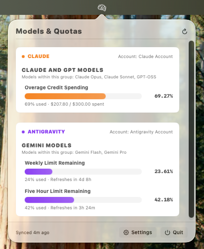
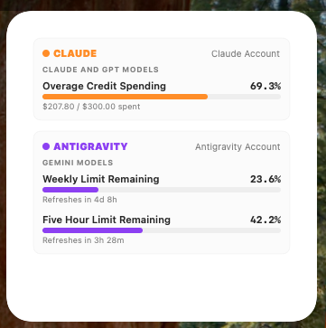
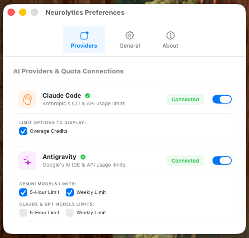
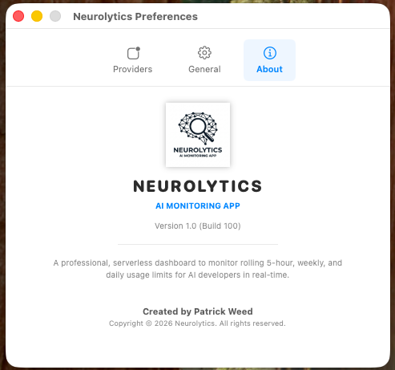

# 🧠 Neurolytics — AI Monitoring App

A native macOS menu bar status item, standalone application window, and desktop widget to monitor real-time AI usage limits for:
1. **Claude (Claude Code / Anthropic)**
2. **Google Antigravity (Gemini & Claude/GPT Limits)**

---

## 📸 Screenshots

| 📱 Menu Bar Status Popover | 🎨 Compact Desktop Widgets |
| :---: | :---: |
|  |  |

| ⚙️ Preferences: AI Connections | ℹ️ About Panel |
| :---: | :---: |
|  |  |

---

## ✨ Features

- **Side-by-Side Monitoring:** Real-time visibility into rolling limits, remaining headroom, spending, and refresh countdowns for your active coding assistants.
- **Google Antigravity Support:** Dynamic, split-group limit tracking separating **Gemini Models** from **Claude & GPT Models** (which run on Antigravity's third-party platform).
- **Customizable Visibility:** Connect-guided display options. Check or uncheck individual limit toggles in Preferences to dynamically hide or show specific quotas across the entire system.
- **Native Widgets (Small, Medium, Large):** View compact quotas on your Mac desktop. The medium widget features highly compact, adaptive labels, while the large widget offers full scrollable, multi-provider detail lists.
- **Enterprise-Grade Security (Zero-Key Repository):** 
  - **No hardcoded secrets:** The codebase is 100% free of hardcoded API keys, secrets, or Client IDs.
  - **Secure Keychain Storage:** Custom Google OAuth Client Secrets are saved and encrypted natively inside the active user's macOS system Keychain. Client IDs reside in local standard plists (`UserDefaults`).

---

## ⚡ Setup & Authentication

### 1. Claude Code
- **Auto-Detect:** If you are already logged in to the `claude` CLI, Neurolytics silently extracts your OAuth token from your macOS Keychain (service `Claude Code-credentials` under your active `$USER` account).
- **On-Demand:** If Claude Code is missing, click **Connect** in the Providers Tab. It launches our secure local loopback listener on port `54321`, opens your browser to `claude.com/cai/oauth/authorize` to sign in, and automatically completes the PKCE token exchange.

### 2. Google Antigravity
- **Manual Credentials Setup:** 
  1. Click **Connect** under Antigravity in Settings.
  2. Input your own custom Google Cloud Platform **OAuth Client ID** and **OAuth Client Secret** (created as a *Desktop Application* type in your Google Cloud Console, with the *Cloud Code API* enabled).
  3. Click **Connect & Sign In**. The app securely encrypts your secret into your Keychain, launches the local listener on port `51121`, and opens your default browser.
  4. Approve the consent screen, complete the secure PKCE handshake, and return!
- **Auto-Detect:** If you're already authenticated with the official `agy` command-line tool, Neurolytics will automatically scan and reuse your active local sessions from `.codexbar/antigravity/oauth_creds.json` or your secure system Keychain.

---

## 🛠️ Building & Packaging

Compiling Neurolytics on any macOS Sonoma or Sequoia machine with Xcode Command Line Tools installed is incredibly simple:

1. Clone or open the repository.
2. Compile and package the standalone app bundle and the WidgetKit extension:
   ```bash
   ./package_app.sh
   ```
3. **Success!** Your fully compiled, ad-hoc signed, and entitlement-configured app is created at:
   - **Main App:** `build/Neurolytics.app`
   - **Distribution Archive:** `build/Neurolytics.zip`

---

## 📥 AirDrop / Gatekeeper Quarantine ("App is Damaged")

When sharing your unsigned developer app bundle (`Neurolytics.app`) with friends or colleagues over AirDrop, Slack, or email, macOS's security layer (Gatekeeper) will flag it as untrusted. 

If they see the alert:
> **"Neurolytics" is damaged and can't be opened. You should move it to the Trash.**

They can clear the quarantine flag immediately by running this single command in their Terminal:
```bash
xattr -rd com.apple.quarantine /Applications/Neurolytics.app
```

---

### 📦 Dynamic Installation via curl (Bypasses Quarantine)
Alternatively, because command-line tools like `curl` do not trigger browser quarantine flags, they can install the app natively and run it immediately without any security warnings by executing your installer script:
```bash
curl -fsSL https://raw.githubusercontent.com/patrickweedS1/ai_usagelimit_checker/main/install.sh | bash
```

---

*Created by Patrick Weed. Copyright © 2026 Neurolytics. All rights reserved.*
